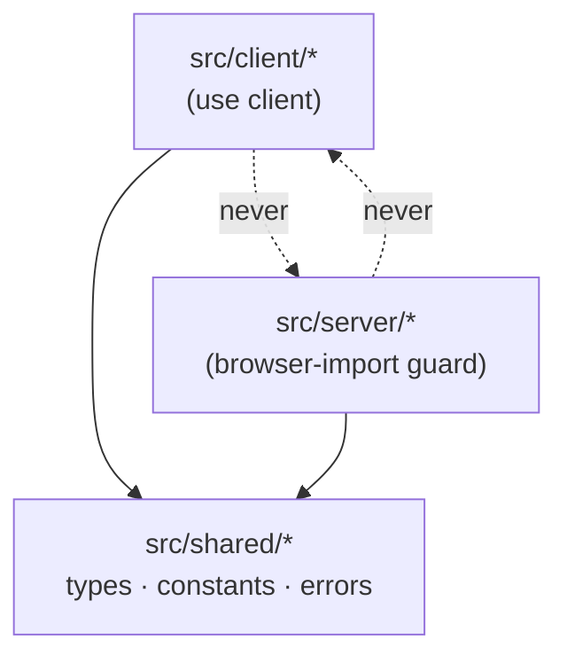

# Architecture — next-grecaptcha

## Monorepo shape

pnpm workspaces:

- `packages/next-grecaptcha` — the library
- `examples/app-router` — Next.js App Router demo; the integration verification target. Pages Router support is covered by unit tests + README docs, not a second example app.

## Module boundaries (the load-bearing decision)

Three entry points, three guarantees:

| Entry | Contents | Guarantee |
|---|---|---|
| `next-grecaptcha/client` | components + hooks | `"use client"` directive survives tsup bundling (verified by grep in `pnpm verify`) |
| `next-grecaptcha/server` | siteverify client + adapters | throws a clear error at import time if `typeof window !== "undefined"`; secret key unreachable from any client entry |
| `next-grecaptcha` (root) | shared types + error classes | imports in plain Node with zero React and zero secret-handling code in its module graph |

Build: tsup emits ESM + CJS + .d.ts per entry.

## Client side (`src/client/`)

- **loader.ts** — singleton-promise script loader. Injects exactly one `<script>` tag regardless of mount count (idempotent under Strict Mode double-effects and client-side navigation). Builds the URL from options: host (`google.com` default, `recaptcha.net` alternative), `render=explicit` (v2) or `render=<siteKey>` (v3), `hl`, optional CSP `nonce`, and a generated-and-cleaned-up `onload=` global callback. Returns `Promise<Grecaptcha>` typed by `src/shared/grecaptcha.d.ts`.
- **ReCaptchaProvider** — context for siteKey(s), version, host, language, nonce, v3 auto-load. Prop-level overrides allowed on consumers.
- **ReCaptchaCheckbox** (v2) — container div + explicit `grecaptcha.render`; theme/size/tabindex; `onToken`/`onExpired`/`onErrored`; `reset()`/`getResponse()` via ref. Multiple independent widgets per page (widget-ID tracking).
- **ReCaptchaInvisible** (v2) — `size:"invisible"`, badge position; `execute(): Promise<string>` via ref (resolved in render callback, rejected on error-callback); `reset()`.
- **useReCaptchaV3** — `{ executeRecaptcha(action), isReady }`; validates action names (`[A-Za-z0-9/_]` only), wraps `grecaptcha.ready` + `execute`.
- **ReCaptchaBadgeNotice** — Google's required attribution text for sites hiding the v3 badge.
- SSR safety: no `window` access at module scope anywhere; every component/hook no-ops on the server and hydrates cleanly.

## Server side (`src/server/`)

- **verifyRecaptcha(token, options)** — POST to `siteverify` (google.com or recaptcha.net) with a form-encoded body (never JSON): `secret`, `response`, optional `remoteip`. Global `fetch` only (Node 18+, Edge, middleware). Secret from `options.secretKey` else `process.env.RECAPTCHA_SECRET_KEY`, else a typed configuration error. Returns a discriminated union (`success: true/false` with typed `errorCodes`); never throws on verification failure.
- **assertRecaptcha(token, options)** — strict v3 variant enforcing expectedAction, minScore (default 0.5), expectedHostname(s); throws `RecaptchaScoreError` / `RecaptchaActionMismatchError` / `RecaptchaHostnameError`.
- **Adapters** (all thin, all reusing `verifyRecaptcha`): `withRecaptcha` for App Router Route Handlers (configurable token source, default header `x-recaptcha-token`; 400/403 JSON on failure), an equivalent Pages Router wrapper, and `verifyRecaptchaAction(formData | token, options)` for Server Actions.
- **Verifier seam** — verification sits behind a small `Verifier` interface so a future reCAPTCHA Enterprise adapter can be added without breaking changes. Not implemented now.

## Shared (`src/shared/`)

All public types, the global `grecaptcha.d.ts` declaration (render, reset, getResponse, execute, ready — full option/return types), error classes extending a base `RecaptchaError`, constants (script hosts, siteverify URLs, default score threshold, token TTL note).

## v1 stub

Any v1-named import path throws a descriptive error explaining Google's March 2018 shutdown and pointing to v2/v3 — a clear message instead of module-not-found for users migrating ancient code.
